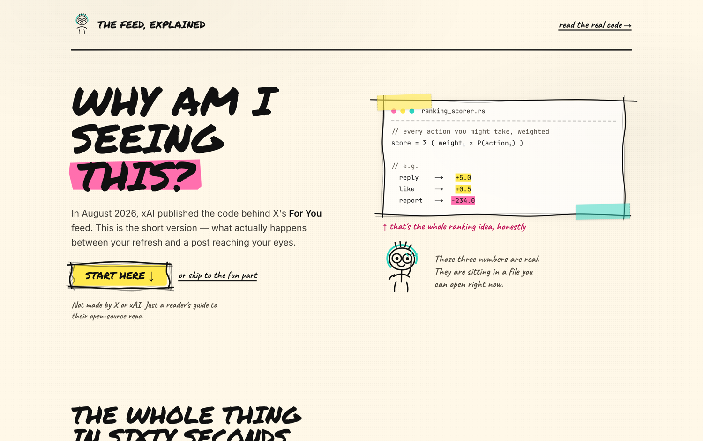
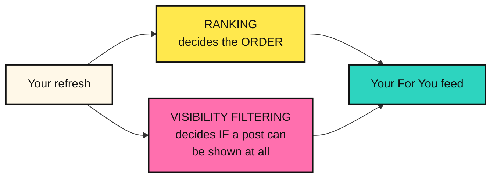
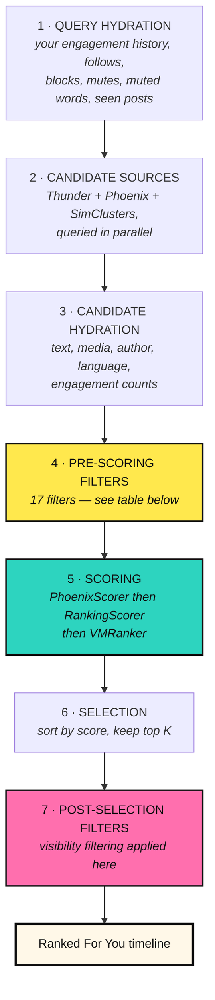
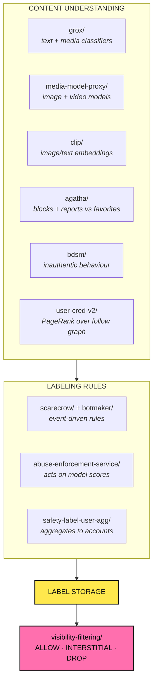
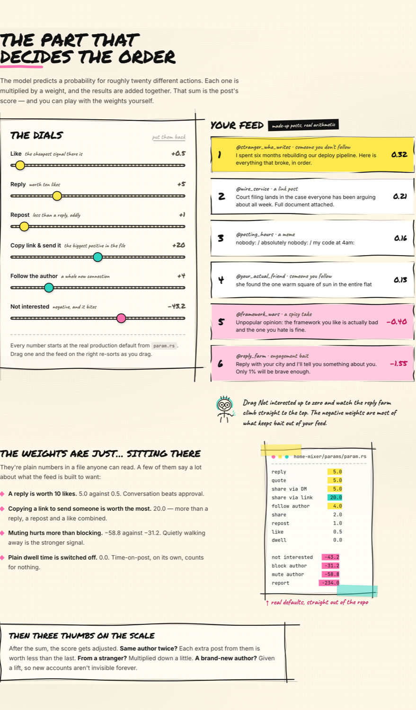

<div align="center">

# Why am I seeing this?

**A short, visual explainer for [`xai-org/x-algorithm`](https://github.com/xai-org/x-algorithm) — the open-source code behind X's For You feed.**

Built as a hand-drawn technical zine. Real weights, real stage names, plain English.

### **[→ Open the live page](https://x-algorithm-explained-ten.vercel.app/)**

[](https://nextjs.org)
[](https://www.typescriptlang.org)
[](https://tailwindcss.com)
[](#license)



</div>

---

> [!IMPORTANT]
> **This is an independent, unofficial explainer.** It is not affiliated with, endorsed by, or connected to X Corp. or xAI. It contains no X or xAI branding. Everything it describes is derived from the public [`xai-org/x-algorithm`](https://github.com/xai-org/x-algorithm) repository as published **13 August 2026**. The algorithm changes — **the code is the source of truth, not this page.**

---

## Contents

- [What this is](#what-this-is)
- [The algorithm, explained](#the-algorithm-explained)
  - [The one thing people get wrong](#the-one-thing-people-get-wrong)
  - [Where posts come from](#1-where-posts-come-from)
  - [The seven-stage Post Pipeline](#2-the-seven-stage-post-pipeline)
  - [How a post gets scored](#3-how-a-post-gets-scored)
  - [The real weights](#the-real-weights)
  - [Three thumbs on the scale](#4-three-thumbs-on-the-scale)
  - [Every pre-scoring filter](#5-every-pre-scoring-filter)
  - [What gets hidden](#6-what-gets-hidden)
  - [Where the labels come from](#7-where-the-labels-come-from)
  - [The full component map](#the-full-component-map)
- [What's *not* in the source repo](#whats-not-in-the-source-repo)
- [About this site](#about-this-site)
  - [Design](#design)
  - [Project structure](#project-structure)
  - [Running it locally](#running-it-locally)
  - [Deploying](#deploying)
- [Accuracy and sources](#accuracy-and-sources)
- [License](#license)

---

## What this is

In August 2026, xAI open-sourced the code that assembles the **For You** feed on X. It is a large, multi-service codebase — Rust services, a JAX-trained ranking model, roughly two dozen top-level components. The official README is genuinely good, but it assumes you already read architecture diagrams for a living.

This project is a **single scrollable page** that gets a non-engineer to an accurate mental model in a few minutes, while leaving real technical vocabulary intact for engineers who want to go read the source afterward.

The page is deliberately short — seven sections. **This README is where the depth lives.**

**Design goals**

| Goal | How |
|---|---|
| Accurate, never "simplified into wrong" | Every number and stage name traces to a file in the source repo |
| Serves two audiences at once | Plain-language narrative in marker; real code taped in as photocopy |
| Teaches by doing, not telling | An interactive weight bench you drag to re-rank a feed |
| Never impersonates X or xAI | No logos, no branding, disclaimed in the header, footer, and here |

---

## The algorithm, explained

### The one thing people get wrong

There are **two independent systems**, and conflating them is the most common misunderstanding:



Different services. Different inputs. Different rules. **Ranking never sees the safety rules.** A post is scored and sorted *first*, and only then asked whether it is allowed on your screen.

---

### 1. Where posts come from

Every refresh pulls from two pools **in parallel**, and both are then ranked together by the same model.

| Pool | Component | What it does |
|---|---|---|
| **In-network**<br/>(people you follow) | [`thunder/`](https://github.com/xai-org/x-algorithm/tree/main/thunder) | Holds recent posts in memory as they're published, returns those from accounts you follow |
| **Out-of-network**<br/>(strangers) | [`phoenix/`](https://github.com/xai-org/x-algorithm/tree/main/phoenix) retrieval | Embeds you and each post as vectors, returns the posts nearest to you |
| **Out-of-network** | [`simclusters/`](https://github.com/xai-org/x-algorithm/tree/main/simclusters) | Clusters accounts and posts by who engages with what, pulls candidates from your clusters |

> [!NOTE]
> A common myth is that in-network and out-of-network posts are ranked separately and then interleaved. They aren't. They go into **one list, scored by one model**. What *does* differ is a deliberate out-of-network discount applied after scoring — see [Three thumbs on the scale](#4-three-thumbs-on-the-scale).

---

### 2. The seven-stage Post Pipeline



This is the **Post Pipeline** (`PhoenixCandidatePipeline`). It's wrapped by a **Blending Pipeline** (`ForYouCandidatePipeline`) which adds everything the model doesn't rank: ads, Who-to-Follow recommendations, and prompts. Stages can be toggled individually, with defaults in [`home-mixer/params/param.rs`](https://github.com/xai-org/x-algorithm/blob/main/home-mixer/params/param.rs).

---

### 3. How a post gets scored

The Phoenix model predicts a **probability for each action you might take** on each post — roughly twenty of them:

| Group | Actions |
|---|---|
| **Engagement** | favorite · reply · repost · quote · share · share via DM · share via copy link |
| **Clicks** | post · profile · link · photo expand · video open · quoted post |
| **Attention** | video quality view · dwell · dwell time · click dwell time · active seconds |
| **Author** | follow author |
| **Negative** | not interested · mute author · block author · report · not dwelled |

Those probabilities are collapsed into a single number by `RankingScorer`:

```
Final Score  =  Σ ( weightᵢ × P(actionᵢ) )
```

Positive actions carry positive weights; negative actions carry negative ones. That's the whole idea.

#### The real weights

These are the **actual production defaults** from [`home-mixer/params/param.rs`](https://github.com/xai-org/x-algorithm/blob/main/home-mixer/params/param.rs). xAI runs cron scripts to keep the checked-in defaults matching the primary production values.

| Action | Weight | |
|---|---:|---|
| Share via copy link | **+20.0** | the single biggest positive |
| Reply | **+5.0** | |
| Quote | **+5.0** | |
| Share via DM | **+5.0** | |
| Follow author | **+4.0** | |
| Share | +2.0 | |
| Repost | +1.0 | |
| Favorite (like) | +0.5 | 10× less than a reply |
| Click | +0.4 | |
| Open link | +0.2 | |
| Photo expand | +0.05 | |
| Video open | +0.05 | |
| Video quality view | +0.05 | |
| Quoted click | +0.05 | |
| Post unexplored | +0.02 | |
| Continuous dwell time | +0.004 | |
| Profile click | 0.0 | switched off |
| Dwell | **0.0** | raw time-on-post counts for nothing |
| Quoted VQV | 0.0 | |
| Click dwell time | 0.0 | |
| Not dwelled | −0.02 | |
| Block author | **−31.2** | |
| Not interested | **−43.2** | |
| Mute author | **−58.8** | muting hurts more than blocking |
| Report | **−234.0** | 468× a like, in the opposite direction |

**What this table tells you**

- **Conversation beats approval.** A predicted reply is worth ten predicted likes.
- **Sending a post to someone is worth more than anything else.** Copy-link share at +20.0 outweighs a reply, a repost and a like combined.
- **The negatives dwarf the positives.** A single predicted report outweighs hundreds of predicted likes. Negative-action weights are most of what keeps engagement bait out of a feed.
- **Time-on-post, alone, is not the target.** Plain `dwell` sits at 0.0.

---

### 4. Three thumbs on the scale

After the weighted sum, three adjustments are applied:

| Adjustment | Effect |
|---|---|
| **Author diversity** | Each post after an author's first is multiplied by a decaying factor, down to a floor — so one account can't take over your feed |
| **Out-of-network discount** | Posts from accounts you don't follow are multiplied by a factor below 1 (as are replies and reposts from accounts you do follow) |
| **New-author boost** | Posts from authors below an impressions threshold are lifted toward a target position, so new accounts aren't invisible forever |

`VMRanker` then calls [`vm-ranker/`](https://github.com/xai-org/x-algorithm/tree/main/vm-ranker), a separate service that reorders results using a determinantal point process over post embeddings — trading a little score for less similarity between neighbouring posts.

---

### 5. Every pre-scoring filter

Applied in this order, before anything is scored ([`home-mixer/filters/`](https://github.com/xai-org/x-algorithm/tree/main/home-mixer/filters)):

| # | Filter | Removes |
|---:|---|---|
| 1 | `DropDuplicatesFilter` | The same post returned by more than one source |
| 2 | `CoreDataHydrationFilter` | Posts whose text and metadata failed to load |
| 3 | `AgeFilter` | Posts older than 48 hours |
| 4 | `SelfTweetFilter` | Your own posts |
| 5 | `OONRetweetReplyFilter` | Reposts/replies from accounts you don't follow, and replies whose parent is missing |
| 6 | `OONNsfwSimclustersFilter` | SimClusters posts whose author is flagged for adult content, when you don't follow them |
| 7 | `RetweetDeduplicationFilter` | Repeated reposts of the same post |
| 8 | `IneligibleSubscriptionFilter` | Subscriber-only posts you can't access |
| 9 | `PreviouslySeenPostsFilter` | Posts you've already been shown |
| 10 | `PreviouslySeenPostsBackupFilter` | The same, from a second record of impressions |
| 11 | `PreviouslyServedPostsFilter` | Posts already served earlier in the session |
| 12 | `MutedKeywordFilter` | Posts matching your muted keywords |
| 13 | `AuthorSocialgraphFilter` | Posts from accounts you block or mute |
| 14 | `VideoFilter` | Video posts, when the request excludes video |
| 15 | `TopicIdsFilter` | Posts outside requested topics, and posts in excluded topics |
| 16 | `NewUserMinEngagementFilter` | For new accounts, out-of-network posts below an engagement threshold |
| 17 | `InventoryHoldoutFilter` | A configured percentage of posts, chosen deterministically per post and viewer |

And **after** ranking:

| Filter | Removes |
|---|---|
| `VFFilter` | Posts that visibility filtering answered `DROP` for |
| `AncillaryVFFilter` | Posts whose parent, quoted, or reposted post was itself dropped |
| `DedupConversationFilter` | Additional branches of the same conversation |

---

### 6. What gets hidden

[`visibility-filtering/`](https://github.com/xai-org/x-algorithm/tree/main/visibility-filtering) is asked about every surviving post, and answers one of three ways:

| Answer | Meaning |
|---|---|
| 🟢 **ALLOW** | Show the post normally |
| 🟡 **INTERSTITIAL** | Show it behind a cover the viewer taps through (e.g. adult or graphic media) |
| 🔴 **DROP** | Don't show it — and drop anything whose parent, quoted post, or reposted post was dropped |

Two rules worth knowing:

1. **The first rule that answers `DROP` ends evaluation.**
2. **Some rules only fire for recommendations.** A further rule set applies *only* when a post is being recommended from an account you don't follow, and those rules can only drop. Suspected spam is caught aggressively on the recommendation path — while the same post is allowed through to an actual follower.

Rules are listed in evaluation order in [`visibility-filtering/rules/registry.rs`](https://github.com/xai-org/x-algorithm/blob/main/visibility-filtering/rules/registry.rs).

---

### 7. Where the labels come from

Visibility filtering reads **labels**, produced continuously in the background — nowhere near your refresh.



Plus **your own inputs**: who you block, who you mute, your muted keywords, your country, and whether you've opted into sensitive media.

---

### The full component map

<details>
<summary><b>All top-level components in the source repo</b> (click to expand)</summary>

**Pipeline framework**

| Component | What it does |
|---|---|
| `home-mixer/` | Builds the For You feed — pipeline stages, scoring weights, calls to other systems |
| `candidate-pipeline/` | The framework `home-mixer` runs on: source, hydrator, filter, scorer, selector, side effect |

**Candidate sources & retrieval**

| Component | What it does |
|---|---|
| `thunder/` | In-memory recent posts from accounts you follow |
| `phoenix/` | Retrieval + ranking model (JAX training, Rust serving) |
| `simclusters/` | Cluster-based candidate discovery |
| `phoenix-rankall/` | Maintains the index Phoenix retrieval queries |
| `phoenix-rankall-strato/` | Event layer deciding which index a post belongs in |
| `vm-ranker/` | Diversity re-ranking via determinantal point process |

**Content understanding**

| Component | What it does |
|---|---|
| `grox/` | Classifiers run as posts are published |
| `media-model-proxy/` | Adult content, violence, hateful symbols, subject matter, known-media matching |
| `clip/` | Trains the image/text embedding model the classifiers consume |
| `agatha/` | Batch jobs labelling accounts from how others respond |
| `bdsm/` | Reads action sequences to spot inauthentic/abusive behaviour |
| `user-cred-v2/` | PageRank over follow and engagement edges |
| `adult-content/` | Trains and calibrates an adult-media classifier |
| `pnsfwmedia/` | Adult-media classifier combining CLIP embeddings with account scores |

**Visibility & enforcement**

| Component | What it does |
|---|---|
| `visibility-filtering/` | The ALLOW / INTERSTITIAL / DROP decision |
| `visibility-filtering-client/` | Client + post safety-label types |
| `scarecrow/` | Applies label rules to events as they happen |
| `botmaker/` | The rule engine: language, compiler, runtime |
| `botmaker-rules/` | The rules scarecrow loads (some withheld) |
| `abuse-enforcement-service/` | Labels, challenges, or suspends accounts from model scores |
| `safety-label-user-agg/` | Labels an account for what its posts collected |
| `under-the-hood/` | Builds the per-account label transparency report |

</details>

---

## What's *not* in the source repo

xAI deliberately withheld a small set of files to reduce gaming, and says so openly:

- **Grox prompts** — the `.j2` files containing specific LLM prompts
- **Some botmaker rules**

To compensate, they ship a transparency tool — [**Under the Hood**](https://x.com/i/under_the_hood) — which shows aggregate statistics about the visibility-affecting labels on your own account and posts. Code + transparent outputs, rather than code alone.

Also generally absent: build and deployment manifests, and internal infrastructure imports (`xai_service_runner`, `xai_kafka`). The exception is [`phoenix/`](https://github.com/xai-org/x-algorithm/tree/main/phoenix), which ships a Cargo workspace, a `pyproject.toml`, a quickstart, and synthetic data generation so you can train and serve a small model end to end.

---

## About this site

### Design

The page is built as a **hand-drawn technical zine** — cream photocopy paper, marker ink, three flat highlighter accents, and real code taped in as photocopy. The tension it resolves: marker lettering makes a page friendly, but a weighted-sum formula lettered by hand reads as *cute*, not *credible*. So the narrative is marker; the facts are photocopied monospace, annotated in the margin. Friendly and verifiable at once.

| Token | Value |
|---|---|
| Paper | `#FFF8E8` |
| Ink | `#111111` |
| Highlighter yellow | `#FFE84D` |
| Highlighter pink | `#FF6FAE` |
| Highlighter teal | `#2DD4BF` |
| Display | Permanent Marker |
| Margin notes | Caveat |
| Body | Inter |
| Code | JetBrains Mono |

Nothing is a rounded-rectangle div pretending to be hand-drawn. Every border, underline, and arrow is **generated SVG geometry** from a seeded PRNG ([`src/lib/rough.ts`](src/lib/rough.ts)), so the server and client draw the identical wobble and hydration stays quiet. Each box edge draws into a strip stretched along **its own axis only**, which keeps the wobble amplitude constant whether the box is 60px or 1200px wide — and the edges overshoot their corners and cross, the way a pen does when the wrist carries past the turn.

**The interactive centrepiece** ([`src/components/WeightBench.tsx`](src/components/WeightBench.tsx)) puts the real weights on six draggable sliders. Drag one and six posts re-score and re-order live. Pull *Not interested* up to zero and watch a reply farm climb straight to the top — which is the fastest way to feel what the negative weights are actually doing.



All motion — draw-on ink via `stroke-dashoffset`, self-painting highlighter swipes, staggered panel rise — is neutralised under `prefers-reduced-motion`.

### Project structure

```
src/
├── app/
│   ├── layout.tsx      fonts and metadata
│   ├── page.tsx        the seven sections
│   └── globals.css     design tokens, textures, marker sliders
├── components/
│   ├── zine.tsx        RoughBox · Underline · Swipe · Tape ·
│   │                   Photocopy · Mascot · doodle icon set
│   ├── WeightBench.tsx the interactive scorer
│   └── Reveal.tsx      IntersectionObserver scroll reveals
└── lib/
    └── rough.ts        seeded hand-drawn SVG geometry
```

### Running it locally

```bash
git clone https://github.com/mihhhir08/x-algorithm-explained.git
cd x-algorithm-explained
npm install
npm run dev          # http://localhost:3000
```

```bash
npm run build && npm start    # production build
npm run lint                  # eslint
npx tsc --noEmit              # typecheck
```

### Deploying

Zero-config on Vercel — it detects Next.js automatically.

```bash
npx vercel        # preview
npx vercel --prod # production
```

---

## Accuracy and sources

Every factual claim on the page and in this README is traceable to the source repository:

| Claim | Source |
|---|---|
| Scoring weights | [`home-mixer/params/param.rs`](https://github.com/xai-org/x-algorithm/blob/main/home-mixer/params/param.rs) |
| Score arithmetic | [`home-mixer/scorers/ranking_scorer.rs`](https://github.com/xai-org/x-algorithm/blob/main/home-mixer/scorers/ranking_scorer.rs) |
| Pipeline stages | [`home-mixer/candidate_pipeline/`](https://github.com/xai-org/x-algorithm/tree/main/home-mixer/candidate_pipeline) |
| Filter names and order | [`home-mixer/filters/`](https://github.com/xai-org/x-algorithm/tree/main/home-mixer/filters) |
| Visibility rules | [`visibility-filtering/rules/registry.rs`](https://github.com/xai-org/x-algorithm/blob/main/visibility-filtering/rules/registry.rs) |

**The six example posts on the page are invented**, and labelled as such on the surface ("made-up posts, real arithmetic"). Their predicted probabilities are illustrative — chosen so the arithmetic demonstrates what the real weights do. **The weights themselves are real.**

Found an inaccuracy? Please open an issue — corrections are the entire point of a project like this.

---

## License

MIT — see [LICENSE](LICENSE).

The source repository [`xai-org/x-algorithm`](https://github.com/xai-org/x-algorithm) is licensed by xAI under Apache 2.0. This project contains **no code** from it — only explanation of publicly documented behaviour.

<div align="center">

**[Read the real code →](https://github.com/xai-org/x-algorithm)**

*Made to be argued with.*

</div>
